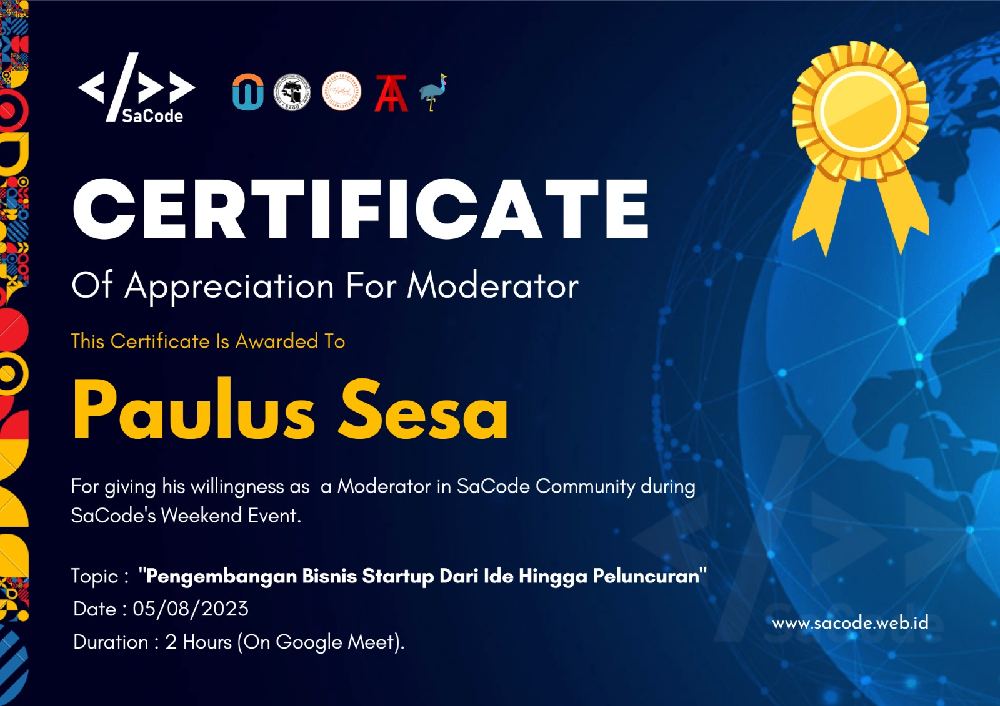
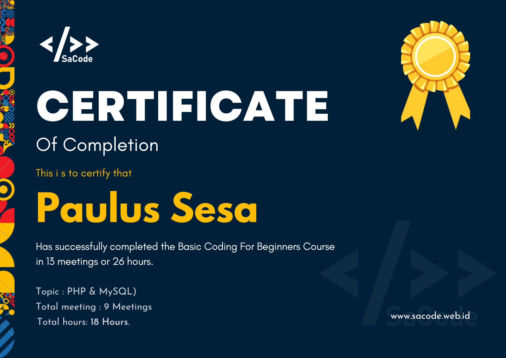

# Pace Koding
 

# SERTIFACATE👇 

Of Appreciation For Moderator 
This Certificate Is Awarded To
<h1>PAULUS SESA</h1>
For giving his willingness as a Moderator in SaCode Community during SaCode's Weekend Event.
Topic :<h3>"Pengembangan Bisnis Startup Dari Ide Hingga Peluncuran"</h3>
Date  : 05/08/2023
Duration : 2 Hours (On Google Meet).

# photo sertificate
 

# SaCode's 
# Weekend 2023

Dokumentasi kegiatan berbagi dan diskusi 
Komunitas SaCode setiap Akhir pekan.

<h2>Terimakasih kepada Daniel Sedik
yang telah menjadi speaker
di SaCode's Weekend.</h2>

Daniel telah menyampaikan materi dan berbagi
tentang Penerapan Pengembangan Bisnis Startup 
Dari Ide Hingga Peluncuran

# SaCode's Courses
<h2>Kursus coding yang saat ini sedang buka di SaCode.
Silahkan daftar dan belajar.</h2> 

# SERTIFICATE PHP & MYSQLY
<h3>Topic or Skills</h3>

Git & Github
 			

Framework Tailwind CSS
	

PHP Introduction
			

PHP Variable
				

PHP Data Types
			

PHP IF Else
				

PHP Arrays
				

PHP Form
					
 

Mysql Introduction

Mysql Create

Mysql Connect DB

Mysql Insert

Mysql Select

Mysql Update

Mysql Delete

PHPMyadmin

## https://sacode.web.id/laravel
## https://sacode.web.id/html-css
## https://sacode.eb.id/php-mysql

## [Community SaCode](https://www.sacode.web.id/)
Happy Coding💻🚀

